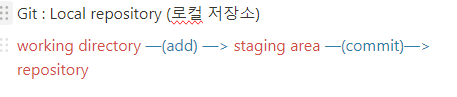

# GUI, CLI
* GUI : Windows GUI
* CLI : cmd --> 윈도우 기반 / powershell, bash--> 리눅스 기반
  
### Q. 왜 개발자들은 bash를 더 많이 쓸까? :
1.  bash는 위, 아래 방향키로 전에 입력했던 명령어들 재 사용
2.  bash는 tab키를 이용해서 자동완성
-> 간편한 명령어, 편리한 개발환경

### Q. git 쓸 때 GUI로 다뤄야 하나요? CLI로 다뤄야 하나요?
A. 그때 그때 다르다. 둘 다 써야 한다. 대부분은 CLI를 쓰지만 diff, graph는 GUI를 씁니다.
* CLI의 장점 : 
  1. Commit 명령어 1초면 끝(GUI는 10초 걸린다.)
  2. 20년전 배웠으면 지금도 쓰고 있고, 앞으로도 쓸 것이다.

* GUI의 장점 :
  1. 보기 편하고, 친숙하고, 기능도 다 있다.
  2. **diff 파일** 비교, **Graph**(시각적이고 복잡한 분석) 훨씬 보기 좋다.

# IDE
* IDE : 통합 개발 환경
* VSCODE : IDE가 아니지만 IDE처럼 사용 가능
  --> 텍스트 에디터(익스텐션을 이용해서 마치 IDE처럼 사용 가능)

### 언어별 IDE
* C# : Visual Studio
* Python : Pycharm, Jup notebook
* Java : Intellij

# URL, API
* URL : "https://"로 시작하는 웹 주소
* API : *Application Programming Interface(도구)*, 클라이언트가 서버에게 요청하는 규칙 API 키는 서버 개발자가 정한다.

# FrameWork
***나는 개발자로서 프로그램을 만들거야!!***
  1. 맨땅에 헤딩(처음부터 코딩)
  2. 소스코드를 다운 받아서 수정하는 방법
  -> FrameWork : 이미 짜여진 소스코드

### 언어별 FrameWork
* Python : Django / Flask
* Java : Spring Boot / Spring MVC (아시아권에서 많이 쓴다.)
* C# : ASP NET Core (주로 미국에서만 쓴다)
* JavaScript : Express(미국에서 엄청 많이 쓴다)

# Git, Github

**Github** : *Remote repository(원격 저장소)*
push, pull
---
* Minnimal GNU for Windows
: 윈도우에서 리눅스에서 쓰는 툴들을 쓸 수 있게 가볍게 만든 프로젝트

| 명령어                           | 설명                                    |
|----------------------------------|-----------------------------------------|
| `~`                              | Home 디렉토리                           |
| `cd ~`                           | 홈 디렉토리로 가기                      |
| `cd -`                           | 뒤로 가기                               |
| `cd ..`                          | 상위 디렉토리로 가기                    |
| `git init`                       | git 시작                                |
| `rm -rf .git`                    | git 종료 (숨긴항목 .git 삭제)           |
| `touch a.txt`                    | 파일 생성                               |
| `rm a.txt`                       | 파일 삭제                               |
| `ls`                             | 현재 디렉토리의 파일 목록 확인          |
| `mkdir new_folder`               | 폴더 생성                               |
| `rm -r new_folder/`              | 폴더 삭제                               |
| `git add .`                      | 모든 파일 add                           |
| `git status`                     | commit 할 준비가 되어있나 확인          |
| `git config --global user.name "장상호"` | commit 작성자 이름 설정                |
| `git config --global user.email "sangho.jang@mincoding.co.kr"` | commit 작성자 이메일 설정               |
| `git commit -m "first_practice"` | commit 메시지 작성                      |
| `git log`                        | commit 로그 확인                        |
| `git remote add origin + URL`                    | 로컬 저장소에서 원격 저장소의 주소를 추가합니다. origin은 원격 저장소의 별칭이며, URL은 원격 저장소의 주소입니다. |
| `git remote -v`                                  | 원격 저장소가 잘 추가되었는지 확인합니다.                            |
| `SHIFT + INSERT`                                 | bash에서 붙여넣기                                                     |
| `git push origin +master`                        | 로컬 저장소의 변경사항을 원격 저장소의 master 브랜치로 푸시합니다.    |
| `.gitignore`                                     | add 하지 않을 파일명을 작성합니다. (예: API 키, 가상환경 등)            |
| `gitignore.io`                                   | gitignore 설정 사이트 (프레임워크 등)                                  |
| `git clone https://github.com/leesanghyeok523/git-test.git` | 새로운 환경에서 GitHub에 있는 프로젝트를 받을 때 사용합니다.         |
| `git pull origin master`                         | 이미 로컬에서 작업 중이고, 원격 저장소에 업데이트가 있는 경우 사용합니다. |

# Git Workflow

## 작업 흐름
1. SSAFY 강의실에서 `push`
2. 집에서 `clone`
3. 다음날 SSAFY 강의실에서 다시 `push`
4. 집에서 `pull`

## 자리를 바꿀 때
자리를 바꾸면 제어판의 자격 증명 관리자에서 GitHub 삭제 후 처음부터 진행합니다.

# HTML

## Hyper Text Markup Language

### Markdown
- 공통점: 로직이 작성되지 않는다.
- Markdown을 배우는 이유:
  - GitHub에서 `README.md` 파일로 활용
  - 프로젝트에 대한 설명을 문서화
  - 가독성, 편의성 향상

# 런타임

### 개념
- 닌텐도 팩
- 실행 머신 ← 런타임

### 예시
- JavaScript로 만든 게임 App
  - 런타임: Node.js
- Python으로 만든 App
  - 런타임: CPython, Pypy (CPython에서 속도를 올린 런타임)
- Java로 만든 게임 App
  - 런타임: JVM (Java Virtual Machine)
- C++, C로 만든 App
  - 런타임이 없음

